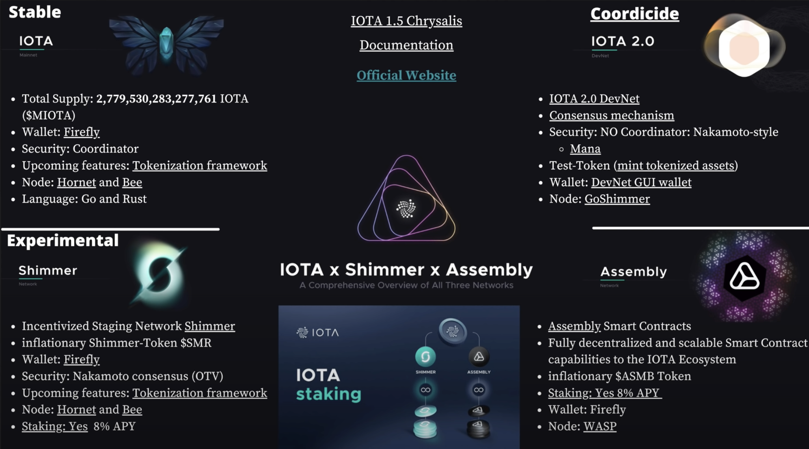

# 2021\_Dec

Soonaverse [Litepaper](https://docs.google.com/document/d/107AWznbIIz1CwsqRO2Jwj5vmqVdj\_2g-eavnmCeTvd8/mobilebasic) \
Ask me anything on youtube: [Ask me Assembly / AMA / Monday, December 6th](https://www.youtube.com/watch?v=wbzOg-gNC9A)\
Building The Future Of Open Worlds on Assembly: [Touchpoint](https://assemblytouchpoint.notion.site/assemblytouchpoint/Welcome-to-Touchpoint-3551f63c45cf492bb1b0bd6b1161b921)\
[List](https://iotaguide.notion.site/List-of-NFT-and-Metaverse-Projects-on-IOTA-4678428b23ce436289cce45a724f80c0) of NFT's and Metaverse project based on IOTA\
[Whitepaper](https://files.iota.org/papers/ISC\_WP\_Nov\_10\_2021.pdf) of IOTA SmartContracts and [Twitter announcement](https://twitter.com/assembly\_net/status/1468233501422071811?s=20)\
TanglePay available for iPhones in App-Store. See [Tweet](https://twitter.com/tanglepaycom/status/1468412935181529089?t=EQVn2edMBUiGHV8vIptJpQ\&s=19)\
[DTag](https://soonaverse.com/space/0x135f8d39d3c99ec3f7a75937bcff2bbaccdc2c97/overview): A game that distributes the effort of image tagging for AI training, incentivizing players, designers, and researchers

Blogpost zu Assembly im [Original](https://blog.assembly.sc/announcing-assembly-and-the-asmb-token/) und auf [deutsch](https://iota-einsteiger-guide.de/iota-assembly-multi-chain-network.html)\
Unique IOTA names for websites, wallet and apps: [Disentangle](https://disentangle.domains)

Some of Hans Moogs ideas / problems IOTA will solve: [Tweets](https://twitter.com/hus\_qy/status/1471663022049566725?s=20)\
Chris Müllers [Weekly-Update](https://www.youtube.com/watch?v=EzpCuqaYJho):

Overview about the [public IOTA nodes](https://thetangle.org/nodes)

